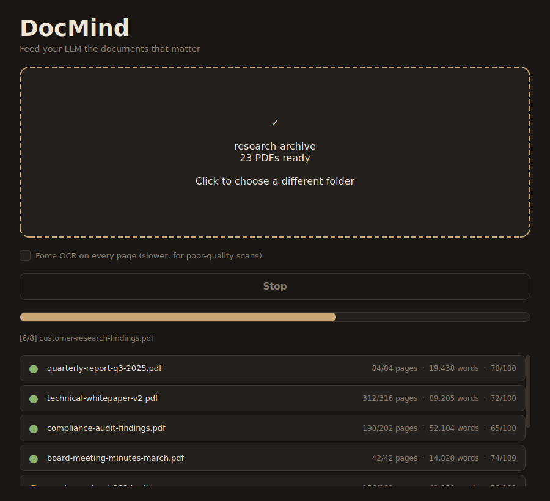
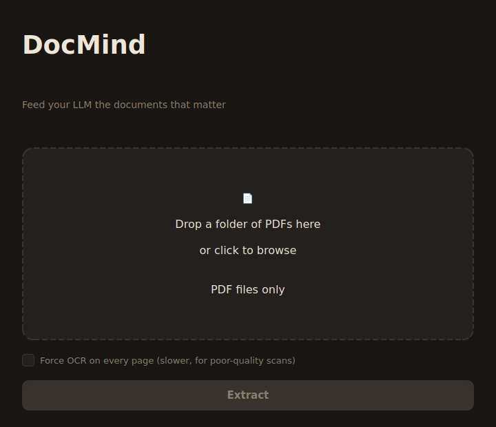
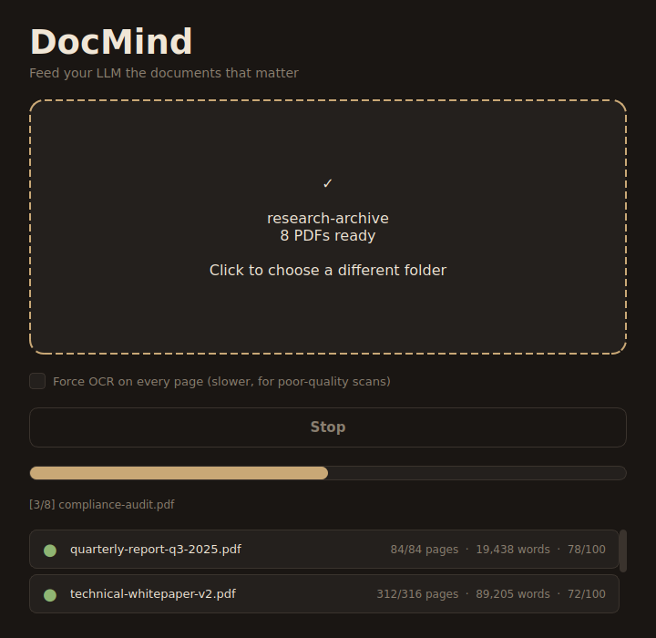
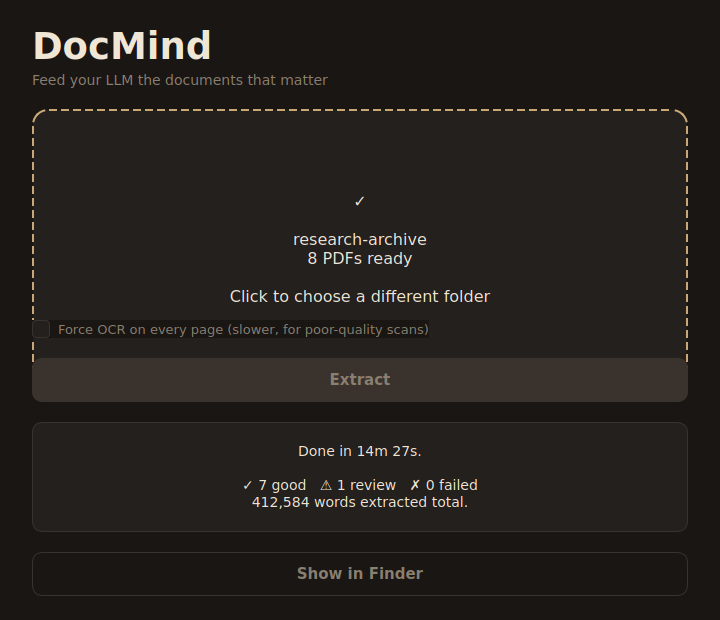

# DocMind

**Turn your PDF collection into something your AI can actually read.**



DocMind is a Mac app that converts your PDF files — including the messy
scanned ones — into clean text your AI can use as reference material.

Drag a folder of PDFs in. Click Extract. Get clean text out.

---

## Why you might want this

You've got PDFs piling up. Research reports, internal documents, manuals,
whitepapers, scanned archives, training materials. You want your AI to
know what's in them — so when you ask a question, it answers from your
documents, not from its general training data.

The problem: most PDF-to-text tools give you junk. Especially when the
PDF started life as a scan. The text comes out garbled, pages get
skipped, and what reaches your AI is a mess that wastes tokens and
confuses the model.

DocMind was built to fix that. Every page is read two ways — through
the PDF's built-in text AND by actually looking at the page image with
OCR — and whichever comes out cleaner wins. The result is readable text
your AI can actually use.

---

## What it looks like

| Drop a folder | Watch it work | Open the results |
|:-:|:-:|:-:|
|  |  |  |

---

## Install it

**You need:** A Mac running macOS 11 or later.

1. **Download DocMind** — click the green **Code** button above, then
   **Download ZIP**. Unzip it anywhere (Desktop is fine).

2. **Open Terminal.** It's in Applications → Utilities, or search
   Spotlight (⌘+Space) for "Terminal".

3. **Go to the DocMind folder.** Type `cd ` (with a space after),
   then drag the unzipped DocMind folder into the Terminal window
   and press Enter.

4. **Run the installer.** Copy-paste this and press Enter:
   ```
   ./install.sh
   ```

The installer will ask for your Mac password (that's normal — it's
installing tools the app needs). Then it works for a few minutes and
finishes with `✓ Done!`.

You'll find **DocMind** in your Applications folder.

> **First time you open it**, macOS will warn you it's from an
> "unidentified developer." That's normal for apps not bought from
> the App Store. Right-click DocMind → **Open** → **Open**. You only
> do this once.

---

## How to use it

1. **Open DocMind** from your Applications folder.
2. **Drag a folder of PDFs** onto the window.
3. **Click Extract.**
4. **Wait.** A small folder takes a few minutes. A big folder of
   scanned documents can take an hour or more. Your Mac can still be
   used for other things while it runs.
5. **Click Show in Finder** when it's done.

You'll get one clean text file for each PDF, plus a report card showing
how well each one came out.

---

## What do I do with the files?

The output is plain text in a format called **Markdown**. Any AI
chatbot can read it. Here are some ways people use it:

**Feed it to ChatGPT / Claude as reference material.** Drag the files
directly into a new chat and say "answer my questions using these
documents." Works with the free tier.

**Build a Claude Skill or a Custom GPT.** Upload the files as a
knowledge base. Now you've got a specialist assistant — a research
helper, an internal-docs expert, a domain advisor — grounded in the
documents you trust.

**Train or fine-tune your own model.** The text is clean enough to use
for training runs if that's your thing.

**Load into a vector database for RAG.** The per-page markers in the
output make it easy to split documents into chunks for retrieval.

---

## Options

Inside the app, there's one checkbox worth knowing about:

**Force OCR on every page** — use this when you're working with really
bad scans. It takes 3–5 times longer, but it reads every page by
looking at the image instead of trusting the text the PDF claims to
have. Turn it on if your first extraction came out garbled.

---

## The report card

When DocMind finishes, it saves a file called `_QC_REPORT.md` in your
output folder. Open it and you'll see a table like:

| File | Pages | Words | Grade |
|---|---|---|---|
| quarterly-report-q3.pdf | 84 | 19,438 | ✅ Good |
| technical-specs-v2.pdf | 312 | 89,205 | ✅ Good |
| archived-memo-1987.pdf | 204 | 41,890 | ⚠️ Review |

- ✅ **Good** — ready to use
- ⚠️ **Review** — readable but worth a spot-check
- ❌ **Poor** — re-run with Force OCR on

---

## Questions people ask

**Is this free?** Yes. Forever.

**Does it send my files anywhere?** No. Everything runs on your Mac.
Your documents never leave your computer.

**Does it work on Windows or Linux?** Not yet. The installer is
Mac-only. The underlying engine is Python and would work on other
systems with some adjustments — see `docs/DEVELOPERS.md` if you want
to try.

**What if a PDF is DRM-protected or password-locked?** DocMind can't
read those. Unlock the PDF first with a tool like Preview or qpdf,
then run it through DocMind.

**Can it handle handwritten notes or math equations?** Not well. It's
built for printed text. Math symbols and handwriting come out messy.

**My PDF came out with garbled text. What do I do?** Turn on the
**Force OCR** checkbox and run it again. That fixes most issues.

**Can I process thousands of PDFs?** Yes. Point it at the folder and
leave it running overnight. The app keeps a progress log so if
something goes wrong partway through, you can restart and it picks up
where it left off.

---

## For developers

Curious how it works, or want to tinker? See
[`docs/DEVELOPERS.md`](docs/DEVELOPERS.md).

The short version: DocMind is a PySide6 desktop app that wraps a
Python extraction engine (`extract_v4.py`). The engine runs text
extraction via PyMuPDF and OCR via Tesseract on every page, scores
both outputs for English-prose quality, and keeps the winner.
Preprocessing is done with OpenCV.

Contributions welcome. Open an issue or a pull request.

---

## Credits

Built with [PyMuPDF](https://pymupdf.readthedocs.io/),
[Tesseract](https://github.com/tesseract-ocr/tesseract),
[OpenCV](https://opencv.org/), and
[PySide6](https://doc.qt.io/qtforpython/).

Made to help more people give their AI better source material to work with.

---

## License

MIT. Use it, share it, remix it. If you make something cool, tell me.
